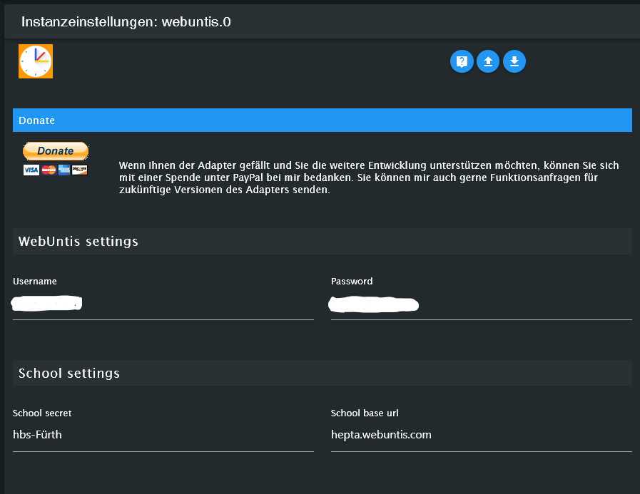

# ioBroker.webuntis

**Tests:** 

## webuntis adapter for ioBroker

Dieser Adapter bezieht Daten aus Webuntis. Für eine deutsche Anleitung

This Adapter get data from WebUntis. For english-tutorial 

## Konfiguration
Nach der Installation des Adapters in Iobroker und dem erstellen einer Instanz, erscheint automatisch
das Konfigurationsfenster.

Zur Vorbereitung, geht man in einem Webbrowser auf die Seite 
Im Suchfeld auf der Seite gibt man den gewünschten Schulnamen ein.
Daraufhin öffnet sich eine Webseite. In der Adresszeile des Browsers stehen nun die gewünschten Daten.

Wir benötigen folgende Strings aus der Adresszeile

- the base-url 
- the school-secret

Im Beispiel-Screenshot sind dies folgende Daten als Beispiel:
https://hepta.webuntis.com/WebUntis/?school=hbs-F%C3%BCrth#/basic/login
        hepta.webuntis.com    => the schoolbase-URL
                                            hbs-F%C3%BCrth   => the school-secret

**Sollte im school-Sercet ein __+__ vorhanden sein. Muss dieses im folgenden Schritt durch ein Leerzeichen ersetzt werden**

Nun wechselt man in Iobroker-Konfigurationsfenster des Adapters

- Unter Username (Kind oder Elternteil) gibt man den Benutzernamen ein.
- Unter Passwort, das Passwort des Users
- Unter school-secret gibt man den Teil der Webadresse ein, der zwischen "/?school" und "#/" steht
- Unter schoolbase-URL gibt man den Teil der Webadresse ein, der zwischen "https://" und "/webuntes/" steht

Speichern und nun erhält man alle Daten die der Adapter abrufen kann.

Wer Anregungen zur Verbesserung des Adapters hat, kann gerne einen hier oder im Iobroker-Forum an uns weiterleiten:
https://forum.iobroker.net/topic/51690/tester-neuer-adapter-webuntis

